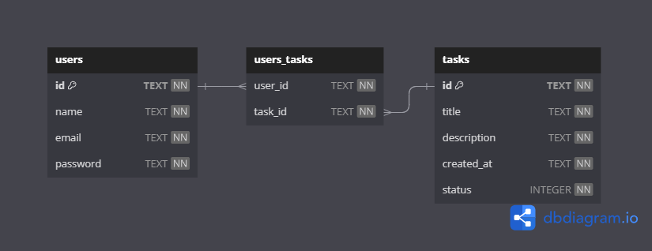

# To-Do List Backend

📌 Clique [**AQUI**](https://documenter.getpostman.com/view/28316385/2s9YR85YvA) para visualizar a documentação! 📄

## Processo de Desenvolvimento

-   [1. Resumo do projeto](#1-resumo-do-projeto)
-   [2. Planejamento](#2-planejamento)
    -   [Tabela](#tabela)
    -   [Descrição](#descrição)
-   [3. Instalações e Configurações](#instalações-e-configurações)
-   [4. Servidor: Express](#4-servidor-express)
-   [5. Query Builder: Knex](#5-query-builder-knex)
-   [6. Endpoints](#6-endpoints)
    -   [Get all users](#get-all-users)
        -   [Get all users | get user by id](#get-all-users--get-user-by-id)
    -   [Create user](#create-user)
    -   [Get all tasks](#get-all-tasks)
        -   [Get all tasks | Get task by title | Get task by description](#get-all-tasks--get-task-by-title--get-task-by-description)
    -   [Create task](#create-task)
    -   [Edit task by id](#edit-task-by-id)
    -   [Delete task by id](#delete-task-by-id)
    -   [Add user to task by id](#add-user-to-task-by-id)
    -   [Remove user from task by id](#remove-user-from-task-by-id)
    -   [Get tasks with users](#get-tasks-with-users)

## 1. Resumo do projeto

[🔼](#processo-de-desenvolvimento)

Este projeto consiste no desenvolvimento de uma API voltada para a gestão de tarefas em uma empresa. O objetivo principal é criar um back-end para uma aplicação de gestão de tarefas, permitindo o cadastro de membros da equipe e o registro das tarefas.

## 2. Planejamento

### Tabela

[🔼](#processo-de-desenvolvimento)

Inicialmente projetei uma **tabela** no site [dbdiagram.io](https://dbdiagram.io/d/to-do-list-backend-652dad15ffbf5169f0ce3bc3) planejando as relações entre as ententidades.



### Descrição

[🔼](#processo-de-desenvolvimento)

Posteriormente utilizei o [Google Sheets](https://docs.google.com/spreadsheets/d/1bNO4TJ3oJtJqxPGkd8Q2vRyw_-Q51BWHV0UiJJUd2gE/edit?usp=sharing) para descrever mais detalhes sobre cada coluna das tabelas:


## Instalações e Configurações

Configurar `.gitignore`

```
node_modules
.env
build
.DS_Store
* .db
package-lock.json
```

Criar `package.json`:

```bash
npm init -y
```

Configurar `package.json`:

```json
{
    "name": "to-do-list-backend",
    "version": "1.0.0",
    "description": "",
    "main": "index.js",
    "scripts": {
        "start": "tsc && node ./build/index.js",
        "dev": "ts-node-dev src/index.ts"
    },
    "author": "",
    "license": "ISC",
    "devDependencies": {
        "@types/cors": "^2.8.14",
        "@types/express": "^4.17.17",
        "@types/knex": "^0.16.1",
        "@types/node": "^20.5.7",
        "ts-node-dev": "^2.0.0",
        "typescript": "^5.2.2"
    },
    "dependencies": {
        "cors": "^2.8.5",
        "express": "^4.18.2",
        "knex": "^3.0.1",
        "sqlite3": "^5.1.6"
    }
}
```

Instalar `package.json`:

```bash
npm i
```

Criar `tsconfig.json`:

```bash
npx tsc --init
```

Configurar `tsconfig.json`:

```json
{
    "compilerOptions": {
        "target": "es2016",
        "module": "commonjs",
        "rootDir": "./src",
        "outDir": "./build",
        "esModuleInterop": true,
        "forceConsistentCasingInFileNames": true,
        "strict": true,
        "skipLibCheck": true,
        "sourceMap": true,
        "noImplicitAny": true,
        "removeComments": true
    }
}
```

## 4. Servidor: Express

[🔼](#processo-de-desenvolvimento)

`src/index.ts`

```ts
import express, { Request, Response } from 'express';
import cors from 'cors';

const app = express();

app.use(cors());
app.use(express.json());

app.listen(3003, () => {
    console.log(`Servidor rodando na porta ${3003}`);
});

app.get('/ping', async (req: Request, res: Response) => {
    try {
        res.status(200).send({ message: 'Pong!' });
    } catch (error) {
        console.log(error);

        if (req.statusCode === 200) {
            res.status(500);
        }

        if (error instanceof Error) {
            res.send(error.message);
        } else {
            res.send('Erro inesperado');
        }
    }
});
```

`Terminal`

```bash
npm run dev
```

`Postman`

```json
// Request:
// GET /ping

// Response:
// status 200 OK
{
    "message": "Pong!"
}
```

## 5. Query Builder: Knex

[🔼](#processo-de-desenvolvimento)

Criar pasta para organizar arquivos do banco de dados:

`src/database`

Criar arquivos de configuração para banco de dados:

`src/database/to-do-list.db`

`src/database/to-do-list.sql`

Criar, popular e conectar as tabelas com a extensão `MySQL`:

`to-do-list.sql`

```sql
CREATE TABLE
    users (
        id TEXT PRIMARY KEY UNIQUE NOT NULL,
        name TEXT NOT NULL,
        email TEXT UNIQUE NOT NULL,
        password TEXT NOT NULL
    );

CREATE TABLE
    tasks (
        id TEXT PRIMARY KEY UNIQUE NOT NULL,
        title TEXT NOT NULL,
        description TEXT NOT NULL,
        created_at TEXT DATETIME DEFAULT (
            strftime(
                '%d-%m-%Y %H:%M:%S',
                'now',
                'localtime'
            )
        ) NOT NULL,
        status INTEGER DEFAULT (0) NOT NULL
    );

CREATE TABLE
    users_tasks (
        user_id TEXT NOT NULL,
        task_id TEXT NOT NULL,
        FOREIGN KEY (user_id) REFERENCES users (id),
        FOREIGN KEY (task_id) REFERENCES tasks (id) ON UPDATE CASCADE ON DELETE CASCADE
    );

INSERT INTO
    users (id, name, email, password)
VALUES (
        'u001',
        'Lily',
        'lily@gmail.com',
        'lily123'
    ), (
        'u002',
        'Atlas',
        'atlas@gmail.com',
        'atlas123'
    );

INSERT INTO
    tasks (id, title, description)
VALUES (
        't001',
        'html',
        'Criar estrutura html do site'
    ), (
        't002',
        'style',
        'Estilizar header do site'
    ), (
        't003',
        'test',
        'Realizar teste de usabilidade'
    ), (
        't004',
        'deploy',
        'Hospedar site na Vercel'
    );

INSERT INTO
    users_tasks (user_id, task_id)
VALUES ('u001', 't001'), ('u002', 't002'), ('u001', 't003'), ('u002', 't003');

SELECT * FROM users;

SELECT * FROM tasks;

SELECT * FROM users_tasks;

DROP TABLE users;

DROP TABLE tasks;

DROP TABLE users_tasks;
```

Criar arquivo de conexão e configuração do `Knex`

`src/database/knex.ts`

```ts
import knex from 'knex';

export const db = knex({
    client: 'sqlite3',
    connection: {
        filename: './src/database/to-do-list.db',
    },
    useNullAsDefault: true,
    pool: {
        min: 0,
        max: 1,
        afterCreate: (conn: any, cb: any) => {
            conn.run('PRAGMA foreign_keys = ON', cb);
        },
    },
});
```

Refatorando o endpoint de ping do `index.ts` para utilizar o `knex` e testar a conexão:

```ts
import express, { Request, Response } from 'express';
import cors from 'cors';
import { db } from './database/knex';

const app = express();

app.use(cors());
app.use(express.json());

app.listen(3003, () => {
    console.log(`Servidor rodando na porta ${3003}`);
});

app.get('/ping', async (req: Request, res: Response) => {
    try {
        const result = await db('users');
        res.status(200).send({ message: 'Pong!', result });
    } catch (error) {
        console.log(error);

        if (req.statusCode === 200) {
            res.status(500);
        }

        if (error instanceof Error) {
            res.send(error.message);
        } else {
            res.send('Erro inesperado');
        }
    }
});
```

`Postman`

```json
// Request:
// GET /ping

// Response:
// status 200 OK
{
    "message": "Pong!",
    "result": [
        {
            "id": "u001",
            "name": "Lily",
            "email": "lily@gmail.com",
            "password": "lily123"
        },
        {
            "id": "u002",
            "name": "Atlas",
            "email": "atlas@gmail.com",
            "password": "atlas123"
        }
    ]
}
```

`index.ts`

Após obter o resultado desejado, deixar as configurações de query builder e desfazer o retorno de users no endpoint de ping:

```ts
(...)
app.get('/ping', async (req: Request, res: Response) => {
    try {
        res.status(200).send({ message: 'Pong!' });
    } catch (error) {
(...)
```

## 6. Endpoints

### Get all users

#### Get all users | get user by id

[🔼](#processo-de-desenvolvimento)

`index.ts`

```ts
// => Get all users:
app.get('/users', async (req: Request, res: Response) => {
    try {
        const searchTerm = req.query.q as string | undefined;
        if (!searchTerm) {
            const result = await db('users');
            res.status(200).send(result);
        } else {
            const result = await db('users').where(
                'name',
                'LIKE',
                `%${searchTerm}%`
            );
            res.status(200).send(result);
        }
    } catch (error) {
        console.log(error);
        if (req.statusCode === 200) {
            res.status(500);
        }
        if (error instanceof Error) {
            res.send(error.message);
        } else {
            res.send('Erro inesperado');
        }
    }
});
```

#### Funcionalidade 1: Visualizar todos os usuários

Esta requisição retorna todos os usuários cadastrados no sistema:

`Postman`

```json
// Request:
// GET /users

// Response:
// status 200 OK
[
    {
        "id": "u001",
        "name": "Lily",
        "email": "lily@gmail.com",
        "password": "lily123"
    },
    {
        "id": "u002",
        "name": "Atlas",
        "email": "atlas@gmail.com",
        "password": "atlas123"
    }
]
```

#### Funcionalidade 2: Visualizar usuários selecionados

Esta requisição retorna os usuários que possuem nomes correspondentes à busca requisitada por query params:

`Postman`

```json
// Request:
// GET /users?q=lily

// Response:
// status 200 OK
[
    {
        "id": "u001",
        "name": "Lily",
        "email": "lily@gmail.com",
        "password": "lily123"
    }
]
```

### Create user

[🔼](#processo-de-desenvolvimento)

`types.ts`

```ts
export type TUsers = {
    id: string;
    name: string;
    email: string;
    password: string;
};

export type TTasks = {
    id: string;
    title: string;
    description: string;
    created_at: string | any;
    status: number;
};

export type TUsersTasks = {
    user_id: string;
    task_id: string;
};

export type TTasksWithUsers = {
    id: string;
    title: string;
    description: string;
    created_at: string | any;
    status: number;
    responsibles: TUsers[];
};
```

`validations.ts`

```ts
import { TUsers, TTasks, TUsersTasks } from './types';
import { Response } from 'express';

// 📌 Precisa ser uma string
export const isString = (
    element: string,
    nameElement: string,
    res: Response
): void => {
    if (typeof element !== 'string') {
        res.statusCode = 400;
        throw new Error(`${nameElement} precisa ser uma string`);
    }
};

// 📌 Precisa ser um number
export const isNumber = (
    element: string | number | undefined | null,
    nameElement: string,
    res: Response
): void => {
    if (typeof element !== 'number') {
        res.statusCode = 400;
        throw new Error(`${nameElement} precisa ser um número`);
    }
};

// 📌 Não pode estar em branco
export const isNotEmpty = (
    element: string | number | undefined | null,
    nameElement: string,
    res: Response
) => {
    if (element === undefined || element === null) {
        res.statusCode = 400;
        throw new Error(`${nameElement} não pode ficar vazio`);
    }
    const inputNoSpaces = String(element).trim();
    if (inputNoSpaces === '') {
        res.statusCode = 400;
        throw new Error(`${nameElement} não pode ficar vazio`);
    }
};

// 📌 Precisa ser único
// ESSE SÓ VERIFICA ID
export const isUniqueId = (
    element: string | number | undefined | null,
    nameElement: string,
    array: TUsers[] | TTasks[],
    res: Response
) => {
    const elementExists = array.find((item) => item.id === element);
    if (elementExists !== undefined) {
        res.statusCode = 400;
        throw new Error(`${nameElement} já cadastrado`);
    }
};

// 📌 Precisa ser único
// ESSE SÓ VERIFICA E-MAIL
export const isUniqueEmail = (
    element: string | number | undefined | null,
    nameElement: string,
    array: TUsers[],
    res: Response
) => {
    const elementExists = array.find((item) => item.email === element);
    if (elementExists !== undefined) {
        res.statusCode = 400;
        throw new Error(`${nameElement} já cadastrado`);
    }
};

//  📌 Precisa ter uma quantidade mínima de caracteres
export const checkMinimumLength = (
    element: string,
    nameElement: string,
    minimumQuantity: number,
    res: Response
) => {
    if (element.length < Number(minimumQuantity)) {
        res.statusCode = 400;
        throw new Error(
            `O ${nameElement} precisa ter no mínimo ${minimumQuantity} caracteres`
        );
    }
};

// => ID
// 📌 Precisa iniciar com um string específica (u ou prod)
export const checkPrefixId = (
    element: string,
    nameElement: string,
    prefix: string,
    res: Response
) => {
    if (!element.startsWith(prefix)) {
        res.statusCode = 400;
        throw new Error(`O ${nameElement} precisa iniciar com "${prefix}"`);
    }
};

// => EMAIL
// 📌 Precisa ter um @gmail | @hotmail | @outlook
export const checkEmail = (
    element: string,
    nameElement: string,
    res: Response
) => {
    const regex = /@(gmail|hotmail|outlook)\.com$/;
    if (!regex.test(element)) {
        res.statusCode = 400;
        throw new Error(
            `O ${nameElement} precisa ser do tipo "gmail", "hotmail" ou "outlook" `
        );
    }
};

// => PASSWORD
// 📌 Deve possuir pelo menos uma letra minúscula, uma letra maiúscula, um número e um caractere especial.
export const checkPassword = (
    element: string,
    nameElement: string,
    res: Response
) => {
    if (
        !element.match(
            // /^(?=.*[a-z])(?=.*[A-Z])(?=.*[0-9])(?=.*[!@#$%^&*()_+{}\[\]:;<>,.?~\\-]).+$/
            /^.{6,}$/
        )
    ) {
        res.statusCode = 400;
        throw new Error(
            // `O ${nameElement} deve possuir pelo menos uma letra minúscula, uma letra maiúscula, um número e um caractere especial`
            `O ${nameElement} deve possuir pelo menos 6 caracteres`
        );
    }
};

// => FUNÇÕES
// 📌 Verificar existência
export const checkElementExists = (
    element: string,
    nameElement: string,
    array: TUsers[] | TTasks[],
    res: Response
) => {
    const elementExists = array.find((item) => item.id === element);
    if (elementExists === undefined) {
        res.statusCode = 400;
        throw new Error(`O ${nameElement} não existe`);
    }
};
```

`index.ts`

```ts
// => Create user
app.post('/users', async (req: Request, res: Response) => {
    try {
        const { id, name, email, password } = req.body;

        // => validações

        // id
        isNotEmpty(id, 'id', res);
        isString(id, 'id', res);
        checkMinimumLength(id, 'id', 4, res);
        const [idAlreadyExists]: TUsers[] | undefined = await db('users').where(
            { id }
        );
        if (idAlreadyExists) {
            res.status(400);
            throw new Error('O "id" não está disponível');
        }

        // name
        isNotEmpty(name, 'name', res);
        isString(name, 'name', res);
        checkMinimumLength(name, 'name', 2, res);

        // email
        isNotEmpty(email, 'email', res);
        isString(email, 'email', res);
        const [emailAlreadyExists]: TUsers[] | undefined = await db(
            'users'
        ).where({ email });
        if (emailAlreadyExists) {
            res.status(400);
            throw new Error('O "email" não está disponível');
        }

        // password
        isNotEmpty(password, 'password', res);
        isString(password, 'password', res);
        checkMinimumLength(password, 'password', 4, res);

        // => funcionalidades:
        const newUser: TUsers = {
            id,
            name,
            email,
            password,
        };
        await db('users').insert(newUser);
        res.status(201).send({
            message: 'User criado com sucesso',
            user: newUser,
        });
    } catch (error) {
        console.log(error);
        if (req.statusCode === 200) {
            res.status(500);
        }
        if (error instanceof Error) {
            res.send(error.message);
        } else {
            res.send('Erro inesperado');
        }
    }
});
```

`Postman`

```json
// Request:
// POST /users
// body JSON
{
    "id": "u003",
    "name": "Verity",
    "email": "verity@gmail.com",
    "password": "verity123"
}

// Response:
// status 201 CREATED
{
    "message": "User criado com sucesso",
    "user": {
        "id": "u003",
        "name": "Verity",
        "email": "verity@gmail.com",
        "password": "verity123"
    }
}
```

### Delete user by id

[🔼](#processo-de-desenvolvimento)

`index.ts`

```ts
// => Delete user by id
app.delete('/users/:id', async (req: Request, res: Response) => {
    try {
        const idToDelete = req.params.id;

        const [idAlreadyExists]: TUsers[] | undefined = await db('users').where(
            { id: idToDelete }
        );
        if (!idAlreadyExists) {
            res.status(404);
            throw new Error('O "id" fornecido não está cadastrado no sistema');
        }

        await db('users').del().where({ id: idToDelete });
        res.status(200).send({
            message: 'User deletado com sucesso',
        });
    } catch (error) {
        console.log(error);
        if (req.statusCode === 200) {
            res.status(500);
        }
        if (error instanceof Error) {
            res.send(error.message);
        } else {
            res.send('Erro inesperado');
        }
    }
});
```

`Postman`

```json
// Request:
// path params = :id
// DELETE /users/u004

// Response:
// status 200 ok
{
    "message": "User deletado com sucesso"
}
```

### Get all tasks

#### Get all tasks | Get task by title | Get task by description

[🔼](#processo-de-desenvolvimento)

`index.ts`

```ts
// => Get all tasks | Get task by title | Get task by description
app.get('/tasks', async (req: Request, res: Response) => {
    try {
        const searchTerm = req.query.q as string | undefined;
        if (!searchTerm) {
            const result = await db('tasks');
            res.status(200).send(result);
        } else {
            const result = await db('tasks')
                .where('title', 'LIKE', `%${searchTerm}%`)
                .orWhere('description', 'LIKE', `%${searchTerm}%`);
            res.status(200).send(result);
        }
    } catch (error) {
        console.log(error);
        if (req.statusCode === 200) {
            res.status(500);
        }
        if (error instanceof Error) {
            res.send(error.message);
        } else {
            res.send('Erro inesperado');
        }
    }
});
```

#### Funcionalidade 1

`Postman`

```json
// Request:
// GET /tasks

// Response:
// status 200 OK
[
    {
        "id": "t001",
        "title": "html",
        "description": "Criar estrutura html do site",
        "created_at": "16-10-2023 21:18:25",
        "status": 0
    },
    {
        "id": "t002",
        "title": "style",
        "description": "Estilizar header do site",
        "created_at": "16-10-2023 21:18:25",
        "status": 0
    },
    {
        "id": "t003",
        "title": "test",
        "description": "Realizar teste de usabilidade",
        "created_at": "16-10-2023 21:18:25",
        "status": 0
    },
    {
        "id": "t004",
        "title": "deploy",
        "description": "Hospedar site na Vercel",
        "created_at": "16-10-2023 21:18:25",
        "status": 0
    }
]
```

#### Funcionalidade 2

`Postman`

```json
// Request:
// GET /tasks?q=style

// Response:
// status 200 OK
[
    {
        "id": "t002",
        "title": "style",
        "description": "Estilizar header do site",
        "created_at": "16-10-2023 21:18:25",
        "status": 0
    }
]
```

#### Funcionalidade 3

`Postman`

```json
// Request:
// GET /tasks?q=criar

// Response:
// status 200 OK
[
    {
        "id": "t001",
        "title": "html",
        "description": "Criar estrutura html do site",
        "created_at": "16-10-2023 21:18:25",
        "status": 0
    }
]
```

### Create task

[🔼](#processo-de-desenvolvimento)

`index.ts`

```ts
// => Create task
app.post('/tasks', async (req: Request, res: Response) => {
    try {
        const { id, title, description } = req.body;

        // id
        isNotEmpty(id, 'id', res);
        isString(id, 'id', res);
        checkMinimumLength(id, 'id', 4, res);
        checkPrefixId(id, 'id', 't', res);
        const [idAlreadyExists]: TTasks[] | undefined = await db('tasks').where(
            { id }
        );
        if (idAlreadyExists) {
            res.status(400);
            throw new Error('O "id" não está disponível');
        }

        // title
        isNotEmpty(title, 'title', res);
        isString(title, 'title', res);
        checkMinimumLength(title, 'title', 2, res);

        // description
        isNotEmpty(description, 'description', res);
        isString(description, 'description', res);
        checkMinimumLength(description, 'description', 2, res);

        const newTask = {
            id,
            title,
            description,
        };
        await db('tasks').insert(newTask);

        const [insertedTask] = await db('tasks').where({ id });

        res.status(201).send({
            message: 'Task criada com sucesso',
            task: insertedTask,
        });
    } catch (error) {
        console.log(error);
        if (req.statusCode === 200) {
            res.status(500);
        }
        if (error instanceof Error) {
            res.send(error.message);
        } else {
            res.send('Erro inesperado');
        }
    }
});
```

`Postman`

```JSON
// Request:
// POST /tasks
// body JSON
{
    "id": "t006",
    "title": "readme",
    "description": "Fazer README do projeto"
}

// Response:
// status 201 CREATED
{
    "message": "Task criada com sucesso",
    "task": {
        "id": "t006",
        "title": "readme",
        "description": "Fazer README do projeto",
        "created_at": "17-10-2023 13:09:45",
        "status": 0
    }
}
```

### Edit task by id

[🔼](#processo-de-desenvolvimento)

`index.ts`

```ts
// => Edit task by id
app.put('/tasks/:id', async (req: Request, res: Response) => {
    try {
        const idToEdit = req.params.id;
        const newId = req.body.id;
        const newTitle = req.body.title;
        const newDescription = req.body.description;
        const newCreatedAt = req.body.createdAt;
        const newStatus = req.body.status;

        const [task]: TTasks[] | undefined[] = await db('tasks').where({
            id: idToEdit,
        });

        if (!task) {
            res.status(404);
            throw new Error('O id fornecido não está registrado no sistema');
        }

        // id
        if (newId !== undefined) {
            isString(newId, 'newId', res);
            checkMinimumLength(newId, 'newId', 4, res);
            checkPrefixId(newId, 'newId', 't', res);
            const [idAlreadyExists]: TTasks[] | undefined = await db(
                'tasks'
            ).where({ id: idToEdit });
            if (idAlreadyExists) {
                res.status(400);
                throw new Error('O "id" não está disponível');
            }
        }

        // title
        if (newTitle !== undefined) {
            isString(newTitle, 'newTitle', res);
            checkMinimumLength(newTitle, 'newTitle', 2, res);
        }

        // description
        if (newDescription !== undefined) {
            isString(newDescription, 'newDescription', res);
            checkMinimumLength(newDescription, 'newDescription', 2, res);
        }
        // createdAt
        if (newCreatedAt !== undefined) {
            isString(newCreatedAt, 'newCreatedAt', res);
        }

        // status
        if (newStatus !== undefined) {
            isNumber(newStatus, 'newStatus', res);
        }

        const newTask: TTasks = {
            id: newId || task.id,
            title: newTitle || task.title,
            description: newDescription || task.description,
            created_at: newCreatedAt || task.created_at,
            status: isNaN(newStatus) ? task.status : newStatus,
        };
        await db('tasks').update(newTask).where({ id: idToEdit });

        res.status(200).send({
            message: 'Task atualizada com sucesso',
            task: newTask,
        });
    } catch (error) {
        console.log(error);
        if (req.statusCode === 200) {
            res.status(500);
        }
        if (error instanceof Error) {
            res.send(error.message);
        } else {
            res.send('Erro inesperado');
        }
    }
});
```

`Postman`

```json
// Request
// path params = :id

// PUT /tasks/t006
// body JSON
{
    "title": "readme",
    "description": "Incluir no readme do projeto labecommerce backend os novos endpoints"
}

// Response
// status 200 OK
{
    "message": "Task atualizada com sucesso",
    "task": {
        "id": "t006",
        "title": "readme",
        "description": "Incluir no readme do projeto labecommerce backend os novos endpoints",
        "created_at": "17-10-2023 13:09:45",
        "status": 0
    }
}
```

### Delete task by id

[🔼](#processo-de-desenvolvimento)

`index.ts`

```ts
// => Delete task by id
app.delete('/tasks/:id', async (req: Request, res: Response) => {
    try {
        const idToDelete = req.params.id;

        const [idAlreadyExists]: TTasks[] | undefined = await db('tasks').where(
            { id: idToDelete }
        );
        if (!idAlreadyExists) {
            res.status(404);
            throw new Error('O "id" fornecido não está cadastrado no sistema');
        }
        await db('users_tasks').del().where({ task_id: idToDelete });
        await db('tasks').del().where({ id: idToDelete });
        res.status(200).send({
            message: 'Task deletada com sucesso',
        });
    } catch (error) {
        console.log(error);
        if (req.statusCode === 200) {
            res.status(500);
        }
        if (error instanceof Error) {
            res.send(error.message);
        } else {
            res.send('Erro inesperado');
        }
    }
});
```

`Postman`

```json
// Request
// path params = :id
// DELETE /tasks/t005

// Response
// status 200 OK
{
    "message": "Task deletada com sucesso"
}
```

### Add user to task by id

[🔼](#processo-de-desenvolvimento)

`index.ts`

```ts
// Adicionando uma pessoa responsável pela tarefa
// => Add user to task by id
app.post(
    '/tasks/:taskId/users/:userId',
    async (req: Request, res: Response) => {
        try {
            const taskId = req.params.taskId;
            const userId = req.params.userId;

            // => validações
            // taskId
            checkPrefixId(taskId, 'taskId', 't', res);
            isNotEmpty(taskId, 'taskId', res);
            checkMinimumLength(taskId, 'taskId', 4, res);
            const [idTaskAlreadyExists]: TTasks[] | undefined = await db(
                'tasks'
            ).where({ id: taskId });
            if (!idTaskAlreadyExists) {
                res.status(400);
                throw new Error(
                    'O "taskId" fornecido não está cadastrado no sistema'
                );
            }
            // userId
            checkPrefixId(userId, 'userId', 'u', res);
            isNotEmpty(userId, 'userId', res);
            checkMinimumLength(userId, 'userId', 4, res);
            const [idUserAlreadyExists]: TUsers[] | undefined = await db(
                'users'
            ).where({ id: userId });
            if (!idUserAlreadyExists) {
                res.status(400);
                throw new Error(
                    'O "userId" fornecido não está cadastrado no sistema'
                );
            }
            // Verificar se o usuário já recebeu a tarefa
            const [existingUserTask]: TUsersTasks[] | undefined = await db(
                'users_tasks'
            ).where({ user_id: userId, task_id: taskId });

            if (existingUserTask) {
                res.status(400);
                throw new Error('O usuário já recebeu essa tarefa');
            }
            //
            const newUserTask: TUsersTasks = {
                user_id: userId,
                task_id: taskId,
            };
            await db('users_tasks').insert(newUserTask);
            res.status(201).send({
                message: 'User atribuído à tarefa com sucesso',
                user: newUserTask,
            });
        } catch (error) {
            console.log(error);
            if (req.statusCode === 200) {
                res.status(500);
            }
            if (error instanceof Error) {
                res.send(error.message);
            } else {
                res.send('Erro inesperado');
            }
        }
    }
);
```

`Postman`

```json
// Request

// path params = :taskId
// path params = :userId

// POST /tasks/:taskId/users/:userId
// POST /tasks/t004/users/u001

// Response
// status 201 CREATED
{
    "message": "User atribuído à tarefa com sucesso",
    "user": {
        "user_id": "u001",
        "task_id": "t004"
    }
}
```

### Remove user from task by id

[🔼](#processo-de-desenvolvimento)

`index.ts`

```ts
// => Remove user from task by id
app.delete(
    '/tasks/:taskId/users/:userId',
    async (req: Request, res: Response) => {
        try {
            const taskId = req.params.taskId;
            const userId = req.params.userId;

            // => validações
            // taskId
            checkPrefixId(taskId, 'taskId', 't', res);
            isNotEmpty(taskId, 'taskId', res);
            checkMinimumLength(taskId, 'taskId', 4, res);
            const [idTaskAlreadyExists]: TTasks[] | undefined = await db(
                'tasks'
            ).where({ id: taskId });
            if (!idTaskAlreadyExists) {
                res.status(400);
                throw new Error(
                    'O "taskId" fornecido não está cadastrado no sistema'
                );
            }
            // userId
            checkPrefixId(userId, 'userId', 'u', res);
            isNotEmpty(userId, 'userId', res);
            checkMinimumLength(userId, 'userId', 4, res);
            const [idUserAlreadyExists]: TUsers[] | undefined = await db(
                'users'
            ).where({ id: userId });
            if (!idUserAlreadyExists) {
                res.status(400);
                throw new Error(
                    'O "userId" fornecido não está cadastrado no sistema'
                );
            }
            await db('users_tasks')
                .del()
                .where({ user_id: userId })
                .andWhere({ task_id: taskId });
            res.status(200).send({
                message: 'User removido da tarefa com sucesso',
            });
        } catch (error) {
            console.log(error);
            if (req.statusCode === 200) {
                res.status(500);
            }
            if (error instanceof Error) {
                res.send(error.message);
            } else {
                res.send('Erro inesperado');
            }
        }
    }
);
```

`Postman`

```json
// Request

// path params = :taskId
// path params = :userId

// DELETE /tasks/:taskId/users/:userId
// DELETE /tasks/t004/users/u001

// Response
// status 200 OK
{
    "message": "User removido da tarefa com sucesso"
}
```

### Get tasks with users

[🔼](#processo-de-desenvolvimento)

`index.ts`

```ts
// => Get tasks with users
app.get('/tasks/users', async (req: Request, res: Response) => {
    try {
        // Implementar essa lógica abaixo:
        /*
        SELECT *
        FROM tasks
        LEFT JOIN users_tasks ON users_tasks.task_id = tasks.id
        LEFT JOIN users ON users_tasks.user_id = users.id;
        */

        // const result = await db('tasks')
        //     .select(
        //         'tasks.id AS taskId',
        //         'title',
        //         'description',
        //         'created_at AS createdAt',
        //         'status',
        //         'user_id AS userId',
        //         'name',
        //         'email',
        //         'password'
        //     )
        //     .leftJoin('users_tasks', 'users_tasks.task_id', '=', 'tasks.id')
        //     .leftJoin('users', 'users_tasks.user_id', '=', 'users.id');

        const tasks: TTasks[] = await db('tasks');

        const result: TTasksWithUsers[] = [];

        for (let task of tasks) {
            const responsibles = [];
            const users_tasks: TUsersTasks[] = await db('users_tasks').where({
                task_id: task.id,
            });
            for (let user_task of users_tasks) {
                const [user]: TUsers[] = await db('users').where({
                    id: user_task.user_id,
                });
                responsibles.push(user);
            }
            const newTaskWithUsers: TTasksWithUsers = {
                ...task,
                responsibles,
            };
            result.push(newTaskWithUsers);
        }

        res.status(200).send(result);
    } catch (error) {
        console.log(error);
        if (req.statusCode === 200) {
            res.status(500);
        }
        if (error instanceof Error) {
            res.send(error.message);
        } else {
            res.send('Erro inesperado');
        }
    }
});
```

`Postman`

```json
// Request:
// GET /tasks/users

// Response:
[
    {
        "id": "t001",
        "title": "html",
        "description": "Criar estrutura html do site",
        "created_at": "16-10-2023 21:18:25",
        "status": 0,
        "responsibles": [
            {
                "id": "u001",
                "name": "Lily",
                "email": "lily@gmail.com",
                "password": "lily123"
            }
        ]
    },
    {
        "id": "t002",
        "title": "style",
        "description": "Estilizar header do site",
        "created_at": "16-10-2023 21:18:25",
        "status": 0,
        "responsibles": [
            {
                "id": "u002",
                "name": "Atlas",
                "email": "atlas@gmail.com",
                "password": "atlas123"
            }
        ]
    },
    {
        "id": "t003",
        "title": "test",
        "description": "Realizar teste de usabilidade",
        "created_at": "16-10-2023 21:18:25",
        "status": 0,
        "responsibles": [
            {
                "id": "u001",
                "name": "Lily",
                "email": "lily@gmail.com",
                "password": "lily123"
            },
            {
                "id": "u002",
                "name": "Atlas",
                "email": "atlas@gmail.com",
                "password": "atlas123"
            }
        ]
    },
    {
        "id": "t004",
        "title": "deploy",
        "description": "Hospedar site na Vercel",
        "created_at": "16-10-2023 21:18:25",
        "status": 0,
        "responsibles": []
    },
    {
        "id": "t006",
        "title": "readme",
        "description": "Incluir no readme do projeto labecommerce backend os novos endpoints",
        "created_at": "17-10-2023 13:09:45",
        "status": 0,
        "responsibles": []
    }
]
```
