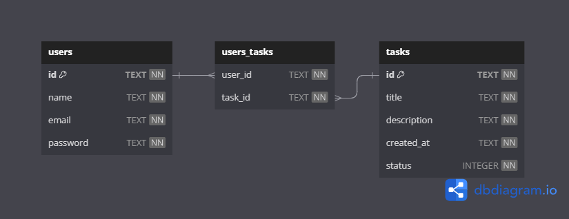
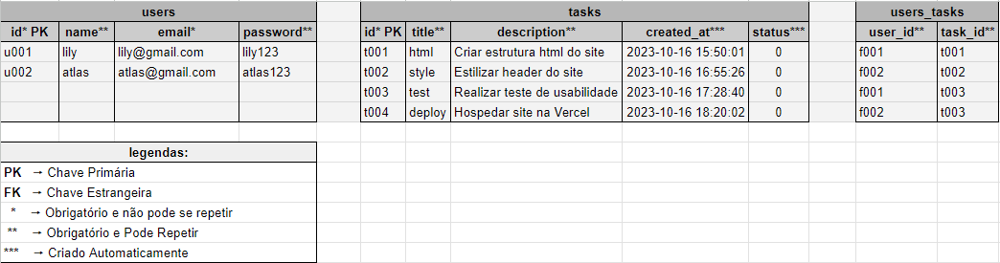

# To-Do List Backend

## Processo de Desenvolvimento

-   [1. Resumo do projeto](#1-resumo-do-projeto)
-   [2. Planejamento](#2-planejamento)
    -   [Tabela](#tabela)
    -   [Descrição](#descrição)

## 1. Resumo do projeto

[🔼](#processo-de-desenvolvimento)

Este projeto consiste no desenvolvimento de uma API voltada para a gestão de tarefas em uma empresa. O objetivo principal é criar um back-end para uma aplicação de gestão de tarefas, permitindo o cadastro de membros da equipe e o registro das tarefas.

## 2. Planejamento

### Tabela

[🔼](#processo-de-desenvolvimento)

Inicialmente projetei uma **tabela** no site [dbdiagram.io](https://dbdiagram.io/d/to-do-list-backend-652dad15ffbf5169f0ce3bc3) planejando as relações entre as ententidades.

### Descrição

[🔼](#processo-de-desenvolvimento)

Posteriormente utilizei o [Google Sheets](https://docs.google.com/spreadsheets/d/1bNO4TJ3oJtJqxPGkd8Q2vRyw_-Q51BWHV0UiJJUd2gE/edit?usp=sharing) para descrever mais detalhes sobre cada coluna das tabelas:

